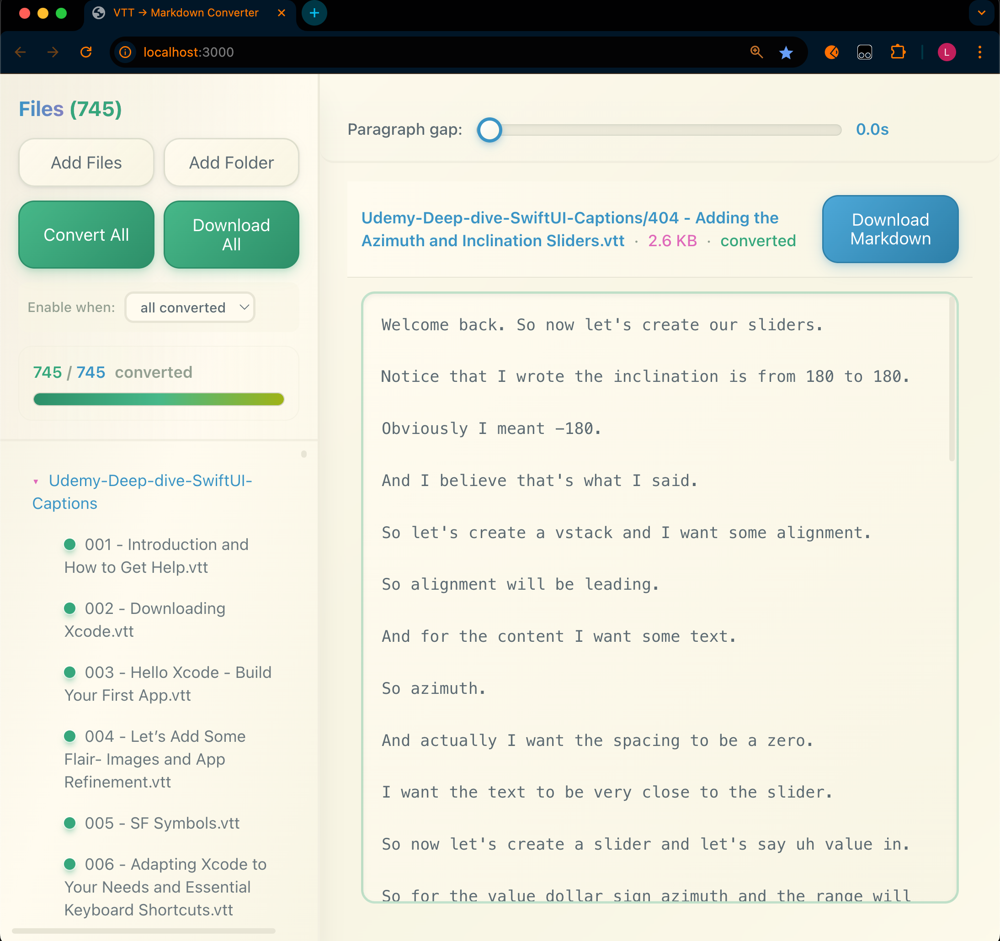

# VTT to Markdown Converter

A web application that converts VTT (WebVTT) subtitle files into clean, readable Markdown documents.



## Features

### File Management
- **Add Files**: Upload individual VTT files
- **Add Folder**: Upload entire folders containing VTT files
- **Drag & Drop**: Drop files or folders directly onto the interface
- **File Tree View**: Browse uploaded files in an organized tree structure

### Conversion
- **Smart Paragraph Detection**: Automatically groups subtitle cues into paragraphs based on configurable time gaps
- **Adjustable Gap Threshold**: Use the slider to set paragraph breaks (0-10 seconds)
- **Batch Conversion**: Convert all files at once with the "Convert All" button
- **Real-time Preview**: See converted markdown instantly in the preview pane

### Export
- **Download All**: Export all converted files as a single ZIP archive
- **Flexible Download Rules**: Choose to enable download when:
  - All files are converted, or
  - At least one file is converted

## How to Use

### Getting Started

1. **Install dependencies:**
   ```bash
   npm install
   ```

2. **Run the development server:**
   ```bash
   npm run dev
   ```

3. **Open your browser:**
   Navigate to `http://localhost:3000`

### Converting Files

1. **Load VTT files** using one of these methods:
   - Click "Add Files" to select individual files
   - Click "Add Folder" to upload a folder
   - Drag and drop files/folders onto the interface

2. **Adjust paragraph gap** (optional):
   - Use the slider to set the time threshold (in seconds)
   - Cues separated by more than this time will form new paragraphs

3. **Convert files**:
   - Click "Convert All" to process all uploaded files
   - Or select individual files and convert them in the preview pane

4. **Download results**:
   - Click "Download All" to get a ZIP file with all converted markdown files
   - Individual files can be previewed in the preview pane

## Production Build

```bash
npm run build
npm start
```

## Testing

```bash
npm test
```
